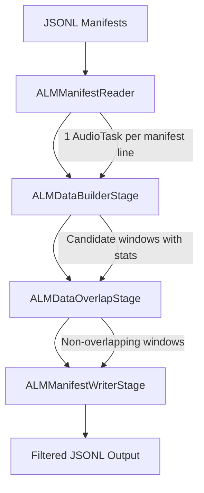

# ALM Pipeline

The Audio Language Model (ALM) pipeline curates training data for audio language models by extracting fixed-duration windows from diarized audio segments. It reads JSONL manifests, builds candidate windows that meet quality constraints, removes overlapping windows, and writes the filtered results to a new manifest.

## Overview

Audio language models require training windows that contain multiple speakers, meet duration targets, and maintain audio quality thresholds. The ALM pipeline automates this extraction process with four stages:

1. **Read**: Stream JSONL manifests line-by-line without loading entire files into memory
2. **Build**: Create candidate windows from consecutive segments, filtering by sample rate, bandwidth, and speaker count
3. **Filter**: Remove overlapping windows, keeping those closest to the target duration
4. **Write**: Output filtered windows as JSONL for downstream training



## Window Construction

`ALMDataBuilderStage` constructs candidate training windows by iterating over consecutive segments within each manifest entry. For each potential starting segment, the stage builds a window by appending subsequent segments until the accumulated duration reaches the target.

The following constraints determine whether a window is valid:

| Constraint | Parameter | Default | Description |
|-----------|-----------|---------|-------------|
| Sample rate | `min_sample_rate` | 16,000 Hz | Minimum audio sample rate for the entry |
| Bandwidth | `min_bandwidth` | 8,000 Hz | Minimum bandwidth per segment |
| Speaker count | `min_speakers`, `max_speakers` | 2, 5 | Required range of distinct speakers per window |
| Duration | `target_window_duration` ± `tolerance` | 120 s ± 10% | Acceptable window duration range (108 to 132 seconds) |
| Truncation | `truncation` | `True` | Whether to truncate segments that exceed the maximum duration |

Each valid window contains a `segments` list and a `speaker_durations` array (top five speakers by duration, zero-padded to length five).

### Loss Tracking

The builder stage tracks why segments are excluded through a `stats` dictionary on each output task. Top-level loss categories include bandwidth below threshold (`lost_bw`), sample rate below threshold (`lost_sr`), speaker count outside range (`lost_spk`), and window duration outside tolerance (`lost_win`). Two additional sub-categories describe why a window's growth stopped inside `lost_win`: `lost_no_spkr` (blocked by a segment without a speaker label) and `lost_next_seg_bm` (blocked by a low-bandwidth segment). These statistics help diagnose pipeline yield and tune parameters.

## Overlap Filtering

`ALMDataOverlapStage` removes redundant windows that share too much audio content. The stage sorts windows by start time and, for each window, compares it against every later window whose start falls before its end — all pairs that overlap in time, not only adjacent ones. When a pair's overlap ratio reaches the threshold, the stage greedily removes the window whose duration is further from `target_duration`.

The `overlap_percentage` parameter controls filtering aggressiveness:

| Value | Behavior | Use Case |
|-------|----------|----------|
| 0 | Remove any overlapping windows | Maximum deduplication |
| 50 | Remove windows with 50% or more overlap | Balanced filtering |
| 100 | Keep all windows except fully-contained duplicates | Minimum filtering |

## Manifest I/O

### Reading

`ALMManifestReader` is a composite stage that decomposes into two sub-stages:

1. **`FilePartitioningStage`**: Discovers and partitions manifest files from a path or list of paths
2. **`ALMManifestReaderStage`**: Reads each partition line-by-line using fsspec, producing one `AudioTask` per JSONL line

This approach avoids loading entire manifests into memory with Pandas, keeping memory usage proportional to a single line rather than three to five times the file size.

### Writing

`ALMManifestWriterStage` appends each `AudioTask` as a JSON line to the output file. It uses a single-writer constraint (`num_workers=1`) to prevent concurrent write conflicts. The stage truncates the output file on setup to ensure clean results across reruns.

Both reader and writer stages support local and cloud paths (S3, GCS) through fsspec.

## Input and Output Formats

### Input

Each line of the input JSONL manifest must contain the following fields:

```json
{
  "audio_filepath": "/path/to/audio.wav",
  "audio_sample_rate": 16000,
  "segments": [
    {
      "start": 0.0,
      "end": 5.2,
      "speaker": "speaker_0",
      "metrics": {"bandwidth": 8000}
    }
  ]
}
```

### Output

Each line of the output JSONL manifest contains the original fields plus pipeline results. The example below highlights the most common fields; the actual output also carries pre-filter candidate `windows`, the input manifest path, and additional duration and diagnostic counters:

```json
{
  "audio_filepath": "/path/to/audio.wav",
  "windows": ["<all candidate windows from the builder stage>"],
  "filtered_windows": [
    {
      "segments": [{"start": 0.0, "end": 5.2, "speaker": "speaker_0"}],
      "speaker_durations": [45.2, 38.1, 22.5, 14.2, 0.0]
    }
  ],
  "filtered_dur": 120.5,
  "filtered_dur_list": [120.5],
  "total_dur_window": 3250.0,
  "truncation_events": 3,
  "stats": {
    "total_segments": 150,
    "total_dur": 3600.0,
    "lost_bw": 5,
    "lost_sr": 0,
    "lost_spk": 12,
    "lost_win": 8,
    "lost_no_spkr": 2,
    "lost_next_seg_bm": 1
  }
}
```

<Note>
Real output also includes additional duration and diagnostic fields (for example, `dur_lost_bw`, `dur_lost_sr`, `audio_sample_rate`, `manifest_filepath`) that are omitted here for brevity.
</Note>

## Related Topics

- **[ALM Tutorial](/curate-audio/tutorials/alm)**: Step-by-step guide for running the ALM pipeline
- **[ALM Data Builder](/curate-audio/process-data/alm/data-builder)**: Detailed reference for window construction parameters
- **[ALM Overlap Filtering](/curate-audio/process-data/alm/overlap-filtering)**: Detailed reference for overlap filtering configuration
- **[Audio Curation Pipeline](/about/concepts/audio/curation-pipeline)**: Overview of the broader audio curation workflow
- **[Manifests and Ingest](/about/concepts/audio/manifests-ingest)**: General manifest format concepts
