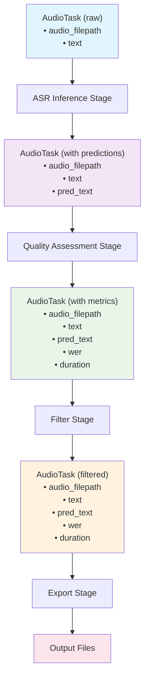

# AudioTask Data Structure

This guide covers the `AudioTask` data structure, which serves as the core container for audio data throughout NeMo Curator's audio processing pipeline.

## Overview

`AudioTask` is a specialized data structure that extends NeMo Curator's base `Task` class to handle audio-specific processing requirements. Each `AudioTask` holds a single manifest entry, matching the convention used by `VideoTask` and `FileGroupTask`:

- **Single-Entry Model**: One manifest entry per task (`Task[dict]`), enabling straightforward per-sample processing
- **File Path Management**: Automatically validates audio file existence and accessibility
- **Metadata Handling**: Preserves audio characteristics and processing results throughout pipeline stages

## Structure and Components

### Basic Structure

```python
from nemo_curator.tasks import AudioTask

# Create AudioTask with a single audio file
audio_task = AudioTask(
    data={
        "audio_filepath": "/path/to/audio.wav",
        "text": "ground truth transcription",
        "duration": 3.2,
        "language": "en"
    },
    filepath_key="audio_filepath",
    task_id="audio_task_001",
    dataset_name="my_speech_dataset"
)
```

### Key Attributes

| Attribute | Type | Description |
|-----------|------|-------------|
| `data` | `dict` | Audio manifest entry (single dict, exposed as `_AttrDict` for attribute-style access) |
| `filepath_key` | `str \| None` | Key name for audio file paths in data (optional) |
| `task_id` | `str` | Unique identifier for the task |
| `dataset_name` | `str` | Name of the source dataset |
| `num_items` | `int` | Always returns `1` (read-only property) |

### Attribute-Style Access

`AudioTask.data` is an `_AttrDict` subclass, so you can access fields as attributes:

```python
audio_task = AudioTask(data={"audio_filepath": "/path/to/audio.wav", "duration": 3.2})

# Both access styles work
audio_task.data["audio_filepath"]  # dict-style
audio_task.data.audio_filepath     # attribute-style
```

## Data Validation

### Automatic Validation

`AudioTask` provides built-in validation for audio data integrity. The `_AttrDict` data type enables `hasattr`-based validation, matching the pattern used by all other modalities.

## Metadata Management

### Standard Metadata Fields

Common fields stored in AudioTask data:

```python
audio_sample = {
    # Core fields (user-provided)
    "audio_filepath": "/path/to/audio.wav",
    "text": "transcription text",

    # Fields added by processing stages
    "pred_text": "asr prediction",    # Added by ASR inference stages
    "wer": 12.5,                     # Added by GetPairwiseWerStage
    "duration": 3.2,                 # Added by GetAudioDurationStage

    # Optional user-provided metadata
    "language": "en_us",
    "speaker_id": "speaker_001",

    # Custom fields (examples)
    "domain": "conversational",
    "noise_level": "low"
}
```

<Note>
Character error rate (CER) is available as a utility function and typically requires a custom stage to compute and store it.
</Note>

## Error Handling

### Graceful Failure Modes

AudioTask handles various error conditions:

```python
# Missing files
audio_task = AudioTask(data={
    "audio_filepath": "/missing/file.wav", "text": "sample"
})
# Validation fails, but processing continues with warnings

# Corrupted audio files
corrupted_sample = {
    "audio_filepath": "/corrupted/audio.wav",
    "text": "sample text"
}
# Duration calculation returns -1.0 for corrupted files

# Invalid metadata
invalid_sample = {
    "audio_filepath": "/valid/audio.wav",
    # Missing "text" field - needed for WER calculation but not enforced by AudioTask
}
# AudioTask does not enforce metadata field requirements. Add a validation stage if required.
```

## Performance Characteristics

### Memory Usage

AudioTask memory footprint is minimal since each task holds a single manifest entry. Memory scales with the number of metadata fields per entry and the total number of tasks processed in the pipeline.

### Processing Patterns

Audio stages follow two processing patterns:

| Pattern | Stages | Method |
|---------|--------|--------|
| **Per-task** | CPU stages (`GetAudioDurationStage`, `GetPairwiseWerStage`) | `process(task) → AudioTask` — mutates `task.data` in-place |
| **Batched** | GPU stages (`InferenceAsrNemoStage`), IO stages (`AudioToDocumentStage`), filtering (`PreserveByValueStage`) | `process_batch(tasks) → list[AudioTask]` |

## Integration with Processing Stages

### Stage Input/Output

AudioTask serves as input and output for audio processing stages. All audio stages subclass `ProcessingStage[AudioTask, AudioTask]` directly:

```python
# CPU stage: mutates task in-place and returns it
def process(self, task: AudioTask) -> AudioTask:
    duration = get_duration(task.data["audio_filepath"])
    task.data["duration"] = duration
    return task
```

### Chaining Stages

AudioTask flows through multiple processing stages, with each stage adding new metadata fields:


