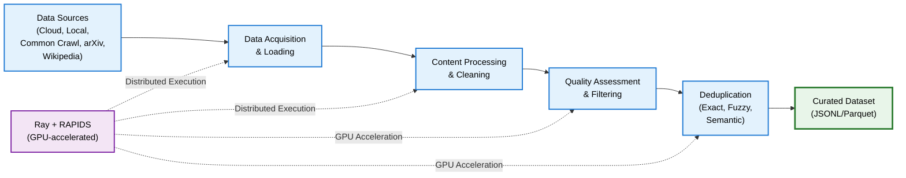

# About Text Curation

NeMo Curator provides comprehensive text curation capabilities to prepare high-quality data for large language model (LLM) training. The toolkit includes a collection of processors for loading, filtering, formatting, and analyzing text data from various sources using a [pipeline-based architecture ](/about/concepts/text/data/data-curation-pipeline).

## Use Cases

- Clean and prepare web-scraped data from sources like Common Crawl, Wikipedia, and arXiv
- Translate multilingual corpora while preserving structured fields and machine-readable payloads
- Create custom text curation pipelines for specific domain needs
- Scale text processing across CPU and GPU clusters efficiently

## Architecture

The following diagram provides a high-level outline of NeMo Curator's text curation architecture.

---

## Introduction

Master the fundamentals of NeMo Curator and set up your text processing environment.

<Cards>

<Card title="Concepts" href="/about/concepts/text">
Learn about pipeline architecture and core processing stages for efficient text curation
data-structures
distributed
architecture
</Card>

<Card title="Get Started" href="/get-started/text">
Learn prerequisites, setup instructions, and initial configuration for text curation
setup
configuration
quickstart
</Card>

</Cards>

## Curation Tasks

### Download Data

Download text data from remote sources and import existing datasets into NeMo Curator's processing pipeline.

<Cards>

<Card title="Read Existing Data" href="/curate-text/load-data/read-existing">
Read existing JSONL and Parquet datasets using Curator's reader stages
jsonl
parquet
</Card>

<Card title="arXiv" href="/curate-text/load-data/arxiv">
Download and extract scientific papers from arXiv
academic
pdf
latex
</Card>

<Card title="Common Crawl" href="/curate-text/load-data/common-crawl">
Download and extract web archive data from Common Crawl
web-data
warc
distributed
</Card>

<Card title="Wikipedia" href="/curate-text/load-data/wikipedia">
Download and extract Wikipedia articles from Wikipedia dumps
articles
multilingual
dumps
</Card>

<Card title="Custom Data Sources" href="/curate-text/load-data/custom">
Implement a download and extract pipeline for a custom data source
jsonl
parquet
custom-formats
</Card>

</Cards>

### Process Data

Transform and enhance your text data through comprehensive processing and curation steps.

<Cards>

<Card title="Language Management" href="/curate-text/process-data/language-management">
Handle multilingual content, translation, and language-specific processing
language-detection
stopwords
translation
multilingual
</Card>

<Card title="Content Processing & Cleaning" href="/curate-text/process-data/content-processing">
Clean, normalize, and transform text content
cleaning
normalization
formatting
</Card>

<Card title="Deduplication" href="/curate-text/process-data/deduplication">
Remove duplicate and near-duplicate documents efficiently
fuzzy-dedup
semantic-dedup
exact-dedup
</Card>

<Card title="Quality Assessment & Filtering" href="/curate-text/process-data/quality-assessment">
Score and remove low-quality content
heuristics
classifiers
quality-scoring
</Card>

<Card title="Specialized Processing" href="/curate-text/process-data/specialized-processing">
Domain-specific processing for code and advanced curation tasks
code-processing
</Card>

<Card title="Synthetic Data Generation" href="/curate-text/synthetic">
Generate and augment training data using LLMs
llm
augmentation
multilingual
nemotron-cc
</Card>

</Cards>
