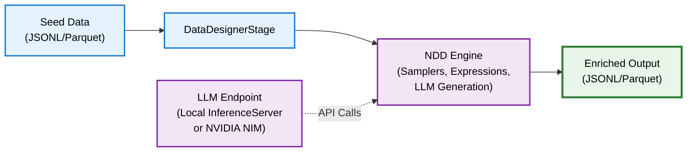

# NeMo Data Designer Integration

[NeMo Data Designer (NDD)](https://nvidia-nemo.github.io/DataDesigner/latest/) is a declarative data generation framework that integrates with NeMo Curator to scale synthetic data pipelines. Instead of writing imperative LLM call logic, you define a configuration that describes what columns to generate, how to sample structured fields, and which LLM to use. NDD handles execution, batching, and token metric collection automatically.

## How It Works

NeMo Curator wraps NDD through the `DataDesignerStage`, which accepts a `DataDesignerConfigBuilder` or a YAML config file. The stage:

1. Takes input records from a `DocumentBatch`
2. Passes them to NDD as a seed dataset
3. Calls `DataDesigner.preview()` to generate new columns (samplers, expressions, LLM text)
4. Returns the enriched dataset as a new `DocumentBatch` with token usage metrics



## Prerequisites

Install the NDD dependency:

```bash
uv pip install --extra-index-url https://pypi.nvidia.com nemo-curator[text_cuda12]
```

The `data-designer` package is included in the text extras. For local model serving, also install:

```bash
uv pip install nemo-curator[inference_server]
```

## DataDesignerStage

The `DataDesignerStage` is the core integration point between NeMo Curator and NDD.

### Parameters

| Parameter | Type | Default | Description |
| --- | --- | --- | --- |
| `config_builder` | `DataDesignerConfigBuilder` | None | NDD configuration builder. Mutually exclusive with `data_designer_config_file`. |
| `data_designer_config_file` | str | None | Path to a YAML config file. Mutually exclusive with `config_builder`. |
| `model_providers` | list | None | Custom `ModelProvider` instances for local or test endpoints. If None, NDD uses its default providers. |
| `verbose` | bool | False | When True, show full NDD log output. |

### Metrics

`DataDesignerStage` automatically collects and reports:

- `ndd_running_time`: Wall-clock time for the NDD `preview()` call
- `num_input_records` / `num_output_records`: Record counts before and after generation
- `input_tokens_median_per_record` / `output_tokens_median_per_record`: Median token counts across all LLM columns

## Building a Configuration

NDD configurations use a builder pattern. You add columns of three types:

<Tip>
For full documentation for building NDD configuration, see the [NDD config builder reference](https://nvidia-nemo.github.io/DataDesigner/latest/code_reference/config_builder/).
</Tip>

### Sampler Columns

Generate structured data using built-in samplers (Faker names, UUIDs, dates):

```python
import data_designer.config as dd

config_builder = dd.DataDesignerConfigBuilder(model_configs=[model_config])

config_builder.add_column(
    dd.SamplerColumnConfig(
        name="patient_name",
        sampler_type=dd.SamplerType.PERSON_FROM_FAKER,
        params=dd.PersonFromFakerSamplerParams(),
    )
)

config_builder.add_column(
    dd.SamplerColumnConfig(
        name="patient_id",
        sampler_type=dd.SamplerType.UUID,
        params=dd.UUIDSamplerParams(prefix="PT-", short_form=True, uppercase=True),
    )
)
```

### Expression Columns

Derive values from other columns using Jinja templates:

```python
config_builder.add_column(
    dd.ExpressionColumnConfig(
        name="first_name",
        expr="{{ patient_name.first_name }}",
    )
)
```

### LLM Text Columns

Generate text using an LLM with prompts that reference other columns:

```python
config_builder.add_column(
    dd.LLMTextColumnConfig(
        name="physician_notes",
        prompt="""\
You are a primary-care physician who just had an appointment with {{ first_name }}.
{{ patient_summary }}
Write careful notes about your visit. Respond with only the notes.
""",
        model_alias="local-llm",
    )
)
```

## End-to-End Example

This example generates synthetic medical notes from seed symptom data using a local `InferenceServer`:

```python
import data_designer.config as dd

from nemo_curator.backends.ray_data import RayDataExecutor
from nemo_curator.core.client import RayClient
from nemo_curator.core.serve import InferenceModelConfig, InferenceServer
from nemo_curator.pipeline import Pipeline
from nemo_curator.stages.synthetic.nemo_data_designer.data_designer import DataDesignerStage
from nemo_curator.stages.text.io.reader.jsonl import JsonlReader
from nemo_curator.stages.text.io.writer.jsonl import JsonlWriter

# Start Ray cluster
client = RayClient(num_cpus=16, num_gpus=4)
client.start()

# Start local inference server
server_config = InferenceModelConfig(
    model_identifier="google/gemma-3-27b-it",
    deployment_config={"autoscaling_config": {"min_replicas": 1, "max_replicas": 1}},
    engine_kwargs={"tensor_parallel_size": 4},
)
inference_server = InferenceServer(models=[server_config])
inference_server.start()

# Configure NDD model
model_config = dd.ModelConfig(
    alias="local-llm",
    model="google/gemma-3-27b-it",
    provider="local",
    skip_health_check=True,
    inference_parameters=dd.ChatCompletionInferenceParams(
        temperature=1.0, top_p=1.0, max_tokens=2048,
    ),
)

model_provider = dd.ModelProvider(
    name="local",
    endpoint=inference_server.endpoint,
    api_key="unused",
)

# Build config with sampler and LLM columns
config_builder = dd.DataDesignerConfigBuilder(model_configs=[model_config])

config_builder.add_column(
    dd.SamplerColumnConfig(
        name="patient_name",
        sampler_type=dd.SamplerType.PERSON_FROM_FAKER,
        params=dd.PersonFromFakerSamplerParams(),
    )
)

config_builder.add_column(
    dd.LLMTextColumnConfig(
        name="physician_notes",
        prompt="You are a physician. Write notes for {{ patient_name.first_name }} "
               "who has {{ diagnosis }}. {{ patient_summary }}",
        model_alias="local-llm",
    )
)

# Build and run pipeline
pipeline = Pipeline(name="ndd_medical_notes")
pipeline.add_stage(JsonlReader(file_paths="seed_data/*.jsonl", fields=["diagnosis", "patient_summary"]))
pipeline.add_stage(DataDesignerStage(config_builder=config_builder, model_providers=[model_provider]))
pipeline.add_stage(JsonlWriter(path="./synthetic_output"))

pipeline.run(executor=RayDataExecutor())

inference_server.stop()
client.stop()
```

## Using a Remote Provider

To use NVIDIA NIM or another hosted endpoint instead of a local server, configure the `ModelProvider` with the remote URL and API key:

```python
import os

import data_designer.config as dd

from nemo_curator.stages.synthetic.nemo_data_designer.data_designer import DataDesignerStage

model_config = dd.ModelConfig(
    alias="nim-llm",
    model="meta/llama-3.3-70b-instruct",
    provider="nvidia",
    inference_parameters=dd.ChatCompletionInferenceParams(
        temperature=0.5, top_p=0.9, max_tokens=1600,
    ),
)

model_provider = dd.ModelProvider(
    name="nvidia",
    endpoint="https://integrate.api.nvidia.com/v1",
    provider_type="openai",
    api_key=os.environ["NVIDIA_API_KEY"],
)

config_builder = dd.DataDesignerConfigBuilder(model_configs=[model_config])
# Add columns as needed...

stage = DataDesignerStage(
    config_builder=config_builder,
    model_providers=[model_provider],
)
```

## NDD-Backed Nemotron-CC Stages

The Nemotron-CC synthetic data stages have NDD-backed equivalents that replace the `AsyncOpenAIClient` with NDD execution. These stages accept the same `input_field`, `output_field`, and prompt parameters, but route generation through `DataDesignerStage` internally.

| Stage | Import Path | Output Field |
| --- | --- | --- |
| `WikipediaParaphrasingStage` | `nemo_curator.stages.synthetic.nemotron_cc.nemo_data_designer.nemotron_cc` | `rephrased` |
| `DiverseQAStage` | `nemo_curator.stages.synthetic.nemotron_cc.nemo_data_designer.nemotron_cc` | `diverse_qa` |
| `DistillStage` | `nemo_curator.stages.synthetic.nemotron_cc.nemo_data_designer.nemotron_cc` | `distill` |
| `ExtractKnowledgeStage` | `nemo_curator.stages.synthetic.nemotron_cc.nemo_data_designer.nemotron_cc` | `extract_knowledge` |
| `KnowledgeListStage` | `nemo_curator.stages.synthetic.nemotron_cc.nemo_data_designer.nemotron_cc` | `knowledge_list` |

These stages inherit from `NDDBaseSyntheticStage`, which auto-builds an NDD config from the prompt fields. You configure the LLM through `model_configs` and `model_providers` instead of an `AsyncOpenAIClient`:

```python
import os

import data_designer.config as dd

from nemo_curator.stages.synthetic.nemotron_cc.nemo_data_designer.nemotron_cc import DiverseQAStage

model_config = dd.ModelConfig(
    alias="meta/llama-3.3-70b-instruct",
    model="meta/llama-3.3-70b-instruct",
    provider="nvidia",
    inference_parameters=dd.ChatCompletionInferenceParams(
        temperature=0.5, top_p=0.9, max_tokens=1600,
    ),
)

model_provider = dd.ModelProvider(
    name="nvidia",
    endpoint="https://integrate.api.nvidia.com/v1",
    provider_type="openai",
    api_key=os.environ["NVIDIA_API_KEY"],
)

stage = DiverseQAStage(
    input_field="text",
    output_field="diverse_qa",
    model_alias="meta/llama-3.3-70b-instruct",
    model_configs=[model_config],
    model_providers=[model_provider],
)
```

## YAML Configuration

Instead of building configs in Python, you can define the entire NDD configuration in a YAML file and pass it to `DataDesignerStage`:

```python
stage = DataDesignerStage(data_designer_config_file="config.yaml")
```

This is useful for reproducible pipelines where the generation config is versioned alongside data artifacts.

---

## Next Steps

- [Inference Server](/curate-text/synthetic/inference-server): Co-locate model serving with your pipeline
- [Nemotron-CC Pipelines](/curate-text/synthetic/nemotron-cc): Advanced text transformation tasks
- [Synthetic Data Generation](/curate-text/synthetic): Overview of all SDG capabilities
